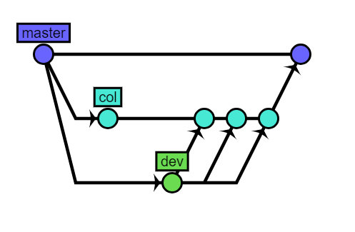

# Mice Git Graph Drawer

Mice Git Graph is an open source js library to draw useful git tree.
Ogni nodo dell'albero rappresenta un merge tra branches del progetto in questione.



## How to use

Inserisci nel codice HTML

```
<canvas id="gitGraph"></canvas>
```

Utlizzare la funzione:
- public projects 
    ```
     createGitgraph(url,version)
    ```
    - **url**: base url of project gitLab
    - **version**: v3 or v4 

- private projects 
    ```
     createGitgraph(url,version,username,password)
    ```
    - **url**: base url of project gitLab
    - **version**: v3 or v4 
    


```
Example:

<button onclick="createGitgraph('https://example.com/example1/testExample.git', 'v3')">DRAW</button>

```

